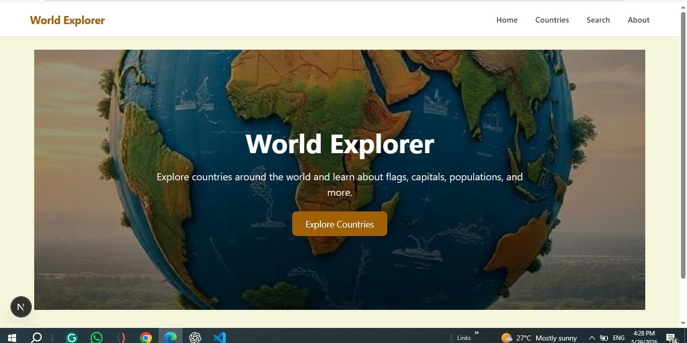
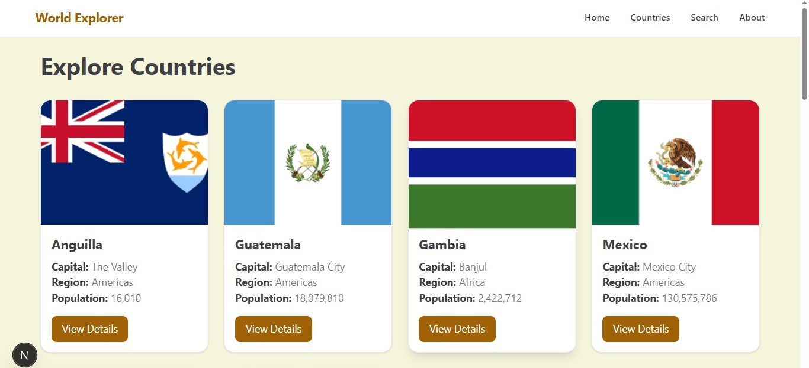
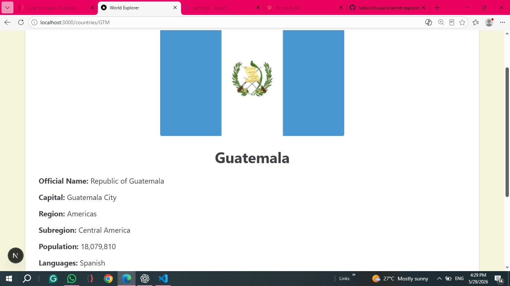
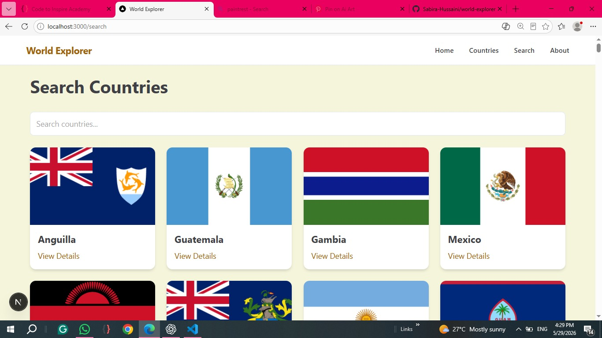

# 🌍 World Explorer

World Explorer is a responsive web application built with **Next.js** that allows users to explore countries around the world using real data from the **REST Countries API**.

The project demonstrates API integration, search and filtering, dynamic routing, data fetching, responsive UI development, and the use of Server and Client Components in Next.js.

## 🌐 Live Demo

**[Visit World Explorer](https://world-explorer-six-tan.vercel.app/)**

## ✨ Features

- 🌍 Browse countries from around the world
- 🔎 Search countries by name
- 🗺️ Filter countries by region
- 📄 View detailed country information
- 🔗 Dynamic routing for country pages
- ⚡ Data fetching from REST Countries API
- 🧩 Server and Client Components
- 📱 Responsive design
- 🎨 Clean and user-friendly interface

## 🛠️ Tech Stack

- Next.js (App Router)
- React
- Tailwind CSS
- REST Countries API

## 🔌 API Used

This project uses the REST Countries API to retrieve country information.

- All countries: `https://restcountries.com/v3.1/all`
- Country by code: `https://restcountries.com/v3.1/alpha/{code}`

## 📄 Pages

| Route | Description |
|---|---|
| `/` | Home page |
| `/countries` | Countries list |
| `/countries/[code]` | Country details |
| `/search` | Search countries |
| `/about` | About page |

## 📸 Screenshots

### Home Page



### Countries Page



### Country Details



### Search Page



## 🚀 Getting Started

### 1. Clone the repository

```bash
git clone https://github.com/Sabira-Hussaini/world-explorer.git
